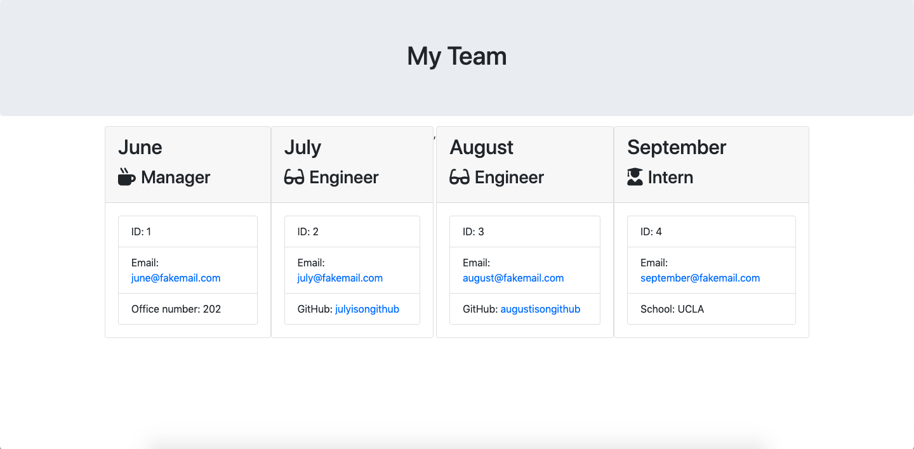

# Team Profile Generator

## How it works

The team profile generator is a CLI application that can be used to generate a team roster for your next project.  It generates an html document showcasing each team meber and their respective roles in the project (i.e. manager, engineer, developer).

## Installation Instructions

Clone this repo to your computer and run 'node app.js' in your terminal.  Run an 'npm i' to gain access to all the necessary node modules.  The terminal will ask a series of questions regarding each team member.  When you exit the program, a new file will be created in the output folder containg the html doc displaying your team members.

## Technologies used

- npm

- inquirer

